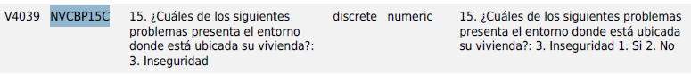

# Resolución de Desafíos del Cuarto y Último Curso de la semana de Inmersión de Datos de Alura Latam

En este último curso de la serie Inmersión de Datos de Alura Latam se dejan los siguientes desafíos:

<b>1- Probar con otros modelos de ML</b>

<b>2- Trabajar más con los datos y crear nuevas variables</b>

<b>3- Probar predicciones para casos reales</b>

<b>4- Crear un proyecto con los resultados de la inmersión y publicarlo en las redes sociales mostrando el trabajo realizado. Recuerda etiquetar a @aluralatam y utilizar los hashtags #InmersionDatos e #InmersionDatosAluraLatam.</b>

## **Resolución primer desafío**

En la clase 4 se utiliza un modelo de regresión lineal y para resolver este desafío utilizaré un **Modelo Polinomial de grado 2** para realizar predicciones. Para lo anterior necesito importar las siguientes clases y funciones escribiendo el siguiente código:

```
from sklearn.preprocessing import PolynomialFeatures
from sklearn.linear_model import LinearRegression
from sklearn.pipeline import make_pipeline
```

Luego instancio (creo) las características polinomiales y el modelo de regresión lineal escribiendo lo siguiente:

```
degree = 2  # Grado del polinomio (puedes ajustar esto)
poly_features = PolynomialFeatures(degree=degree)
linear_regression = LinearRegression()
```

Ahora creo una **pipeline** la cual me permite combinar en un solo paso las etapas de generación de características polinomicas y ajustar el modelo de regresión lineal a las caracteristicas polinomiales anteriores. Lo anterior me genera el modelo a utilizar:

```
model = make_pipeline(poly_features, linear_regression)
```

Luego con la data de entrenamiento definida en el curso la cual es la siguiente:

```
X = datos_ml[['COD_UPZ_GRUPO','Habitaciones','Banos','CONJUNTO_CERRADO','SALARIO_ANUAL_MI','TIENE_ESCRITURA']]

y = datos_ml["Precio_Millon"]

X_train, X_test, y_train, y_test = train_test_split(X, y, test_size = 0.25, random_state = 99)
```

Ajusto el modelo que he creado:

```
model.fit(X_train, y_train)
```

Listo el modelo calculo el error absoluto medio y el coeficiente de determinación (R2) utilizando el siguiente código:

```
y_predict_testPol = model.predict(X_test)
y_predict_trainPol = model.predict(X_train)
mae_testPol = mean_absolute_error(y_test, y_predict_testPol)
r2_testPol = r2_score(y_test, y_predict_testPol)
mae_trainPol = mean_absolute_error(y_train, y_predict_trainPol)
r2_trainPol = r2_score(y_train, y_predict_trainPol)
print(mae_testPol,r2_testPol)
print(mae_trainPol,r2_trainPol)
```

Lo anterior me arroja lo siguiente:


Y al comparar dichos indicadores con los indicadores generados por el modelo creado en el curso los cuales son los siguientes:


Como conclusión se observa que el modelo polinomial explica algo mejor la variabilidad en la data ya que el coeficiente de determinación es algo mayor (0.57 > 0.54).

## **Resolución segundo desafío**

En el segundo desafío se me pide trabajar más con los datos y crear nuevas variables, para lo anterior crearé un modelo de regresión lineal siendo 'INSEGURIDAD' la variable a predecir y 'CONJUNTO_CERRADO', 'TERMINALES_BUS', 'BARES_DISCO', 'RUIDO', 'OSCURO_PELIGROSO', 'PERDIDA_INGRESOS_C19', 'SALARIO_ANUAL_MI' las variables explicativas las cuales he seleccionado en base al mapa de calor de correlaciones que se genera en el curso el cual es el siguiente:


En el curso el instructor utiliza la siguiente tabla hash(diccionario) para sustituir el código que utiliza la encuesta por cadenas de texto explicativas:

```
dic_dane = {
       'NVCBP4':'CONJUNTO_CERRADO',
       'NVCBP14A':'FABRICAS_CERCA', 'NVCBP14D':'TERMINALES_BUS', 'NVCBP14E':'BARES_DISCO',
       'NVCBP14G':'OSCURO_PELIGROSO', 'NVCBP15A':'RUIDO', 'NVCBP15C':'INSEGURIDAD',
       'NVCBP15F':'BASURA_INADECUADA', 'NVCBP15G':'INVASION','NVCBP16A3':'MOV_ADULTOS_MAYORES',
       'NVCBP16A4':'MOV_NINOS_BEBES',
       'NPCKP17':'OCUPACION','NPCKP18':'CONTRATO','NPCKP23':'SALARIO_MES',
       'NPCKP44A':'DONDE_TRABAJA', 'NPCKPN62A':'DECLARACION_RENTA',
       'NPCKPN62B':'VALOR_DECLARACION', 'NPCKP64A':'PERDIDA_TRABAJO_C19',
       'NPCKP64E':'PERDIDA_INGRESOS_C19',
       'NHCCP3':'TIENE_ESCRITURA', 'NHCCP6':'ANO_COMPRA', 'NHCCP7':'VALOR_COMPRA', 'NHCCP8_1':'HIPOTECA_CRED_BANCO',
       'NHCCP8_2':'OTRO_CRED_BANCO', 'NHCCP8_3':'CRED_FNA', 'NHCCP8_6':'PRESTAMOS_AMIGOS',
       'NHCCP8_7':'CESANTIAS', 'NHCCP8_8':'AHORROS', 'NHCCP8_9':'SUBSIDIOS',
       'NHCCP9':'CUANTO_PAGARIA_MENSUAL', 'NHCCP11':'PLANES_ADQUIRIR_VIVIENDA',
       'NHCCP11A':'MOTIVO_COMPRA', 'NHCCP12':'RAZON_NO_ADQ_VIV', 'NHCCP41':'TIENE_CARRO','NHCCP41A':'CUANTOS_CARROS',
       'NHCCP47A':'TIENE_PERROS', 'NHCCP47B':'TIENE_GATOS', 'NHCLP2A':'VICTIMA_ATRACO', 'NHCLP2B':'VICTIMA_HOMICIDIO',
       'NHCLP2C':'VICTIMA_PERSECUSION',
       'NHCLP2E':'VICTIMA_ACOSO', 'NHCLP4':'COMO_VIVE_ECON', 'NHCLP5':'COMO_NIVEL_VIDA',
       'NHCLP8AB':'REACCION_OPORTUNA_POLICIA', 'NHCLP8AE':'COMO_TRANSPORTE_URBANO', 'NHCLP10':'SON_INGRESOS_SUFICIENTES',
       'NHCLP11':'SE_CONSIDERA_POBRE', 'NHCLP29_1A':'MED_C19_TRABAJO',
       'NHCLP29_1C':'MED_C19_CAMBIO_VIVIENDA', 'NHCLP29_1E':'MED_C19_ENDEUDAMIENTO',
       'NHCLP29_1F':'MED_C19_VENTA_BIENES','NPCHP4':'NIVEL_EDUCATIVO'
       }
```

Como yo voy a utilizar las variables explicativas siguientes: 'CONJUNTO_CERRADO', 'TERMINALES_BUS', 'BARES_DISCO', 'RUIDO', 'OSCURO_PELIGROSO', 'PERDIDA_INGRESOS_C19', 'SALARIO_ANUAL_MI'. Necesito de su código para saber el tipo de data que almacena y para posteriormente predecir, para ello tengo la siguiente asociación:

-'CONJUNTO_CERRADO' es 'NVCBP4'
-'TERMINALES_BUS' es 'NVCBP14D'
-'BARES_DISCO' es 'NVCBP14E'
-'RUIDO' es 'NVCBP15A'
-'OSCURO_PELIGROSO' es 'NVCBP14G'
-'PERDIDA_INGRESOS_C19' es 'NPCKP64E'
-'SALARIO_ANUAL_MI' es númerico y corresponde al salario mensual multiplicado por 12 y divido por un millón.

Revisando la documentación tengo que las variables anteriores corresponden a las siguientes preguntas y toman los valores 1 y 2:

-'CONJUNTO_CERRADO' es 'NVCBP4'


-'TERMINALES_BUS' es 'NVCBP14D'


-'BARES_DISCO' es 'NVCBP14E'


-'RUIDO' es 'NVCBP15A'


-'OSCURO_PELIGROSO' es 'NVCBP14G'


-'PERDIDA_INGRESOS_C19' es 'NPCKP64E'


Y la variable a explicar 'INSEGURIDAD' corresponde a 'NVCBP15C' el cual es:



Recordar que la respuesta 1 a cada pregunta se mantiene y el valor 2 se sustituye por un 0.

Lista la identificación de variables ejecuto el siguiente código para crear las datas de entrenamiento y de testeo siendo la data de entrenamiento correspondiente al 85% de la data y la data de testeo correspondiente al 25% de la data:

```
X = datos_ml[['CONJUNTO_CERRADO','TERMINALES_BUS','BARES_DISCO','RUIDO','OSCURO_PELIGROSO','PERDIDA_INGRESOS_C19','SALARIO_ANUAL_MI']]
y = datos_ml['INSEGURIDAD']

X_train, X_test, y_train, y_test = train_test_split(X,y,test_size=0.25,random_state=99)
```

Ahora creo el modelo y lo ajusto con la data de entrenamiento:

```
modelo_2 = LinearRegression()
modelo_2.fit(X_train, y_train)
```

Y ahora calculo el error absoluto medio y el coeficiente de correlación (R2) escribiendo el siguiente código:

```
y_predict_test = modelo_2.predict(X_test)
y_predict_train = modelo_2.predict(X_train)
mae_test = mean_absolute_error(y_test, y_predict_test)
r2_test = r2_score(y_test, y_predict_test)
mae_train = mean_absolute_error(y_train, y_predict_train)
r2_train = r2_score(y_train, y_predict_train)
print(mae_test,r2_test)
print(mae_train,r2_train)
```

Dicho código me genera el siguiente output:


Se observa que el modelo explica bastante bien la variabilidad de la data (R2 de ~0.86).

## **Resolución tercer desafío**

Ahora probaré el modelo utilizando una situación real. Como se sabe tengo como variables explicativas las siguientes:

'CONJUNTO_CERRADO', 'TERMINALES_BUS', 'BARES_DISCO', 'RUIDO', 'OSCURO_PELIGROSO', 'PERDIDA_INGRESOS_C19', 'SALARIO_ANUAL_MI'

Por tanto, considerando para:

-'CONJUNTO_CERRADO' = 0 ,es decir, la edificación NO esta ubicada en un conjunto residencial

-'TERMINALES_BUS' = 1, es decir, la vivienda SI esta cerca de terminales de buses

-'BARES_DISCO' = 1, es decir, la vivienda SI esta cerca de discotecas y bares

-'RUIDO' = 1, es decir, la vivienda SI esta ubicada en un entorno ruidoso

-'OSCURO_PELIGROSO' = 1, es decir, la vivienda SI esta cerca de lotes baldios o sitios oscuros y peligrosos

-'PERDIDA_INGRESOS_C19' = 1, es decir, las personas que habitan dicha edificación registraron una pérdida sustancial a sus ingresos

-'SALARIO_ANUAL_MI': según lo señalado en este [sitio web](https://datosmacro.expansion.com/smi/colombia) el salario mensual en Colombia en el 2022 fue de 1.000.000 de pesos Colombianos lo que al año equivale a 12.000.000 de pesos colombianos por lo que la variable 'SALARIO_ANUAL_MI' la estableceré en 12.

Por tanto, realizaré la siguiente predicción de la variable 'INSEGURIDAD' utilizando los valores que acabo de establecer:

```
modelo_2.predict([[0,1,1,1,1,1,12]])
```

Dicha predicción me genera el siguiente valor:


Dicha predicción esta muy sobre el valor de 1 el cual corresponde a una respuesta afirmativa para la existencia de inseguridad en el entorno donde se ubica la vivienda. En otras palabras, si la vivienda no esta en un conjunto residencial, si esta cerca de terminales de buses, si esta cerca de discotecas y bares, si esta en un entorno ruidoso, si esta cercad de lotes baldíos o sitios oscuros y peligrosos. si la familia perdio ingresos de manera sustancial por el Covid 19 y si su salario corresponde al sueldo mínimo, entonces existe una alta inseguridad en el entorno de la vivienda.

## **Resolución cuarto desafío**

He creado este repositorio, la explicación anterior y he extendido el notebook INMERSION_DATOS_PROYECTO_FINAL.ipynb de la clase como mi proyecto final de la serie de inmersión de datos. Si se desea visualizar el notebook, clonar este repositorio a su máquina local y ejecutar las celdas.
